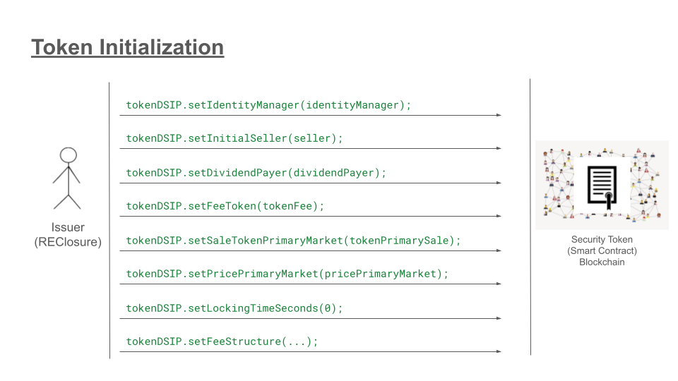
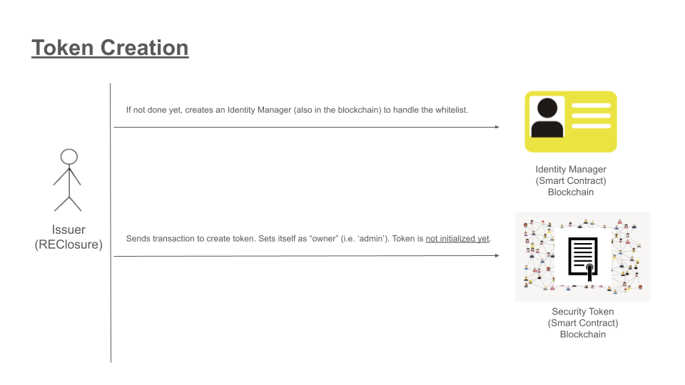
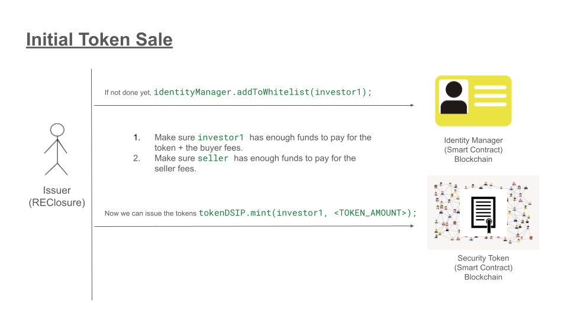
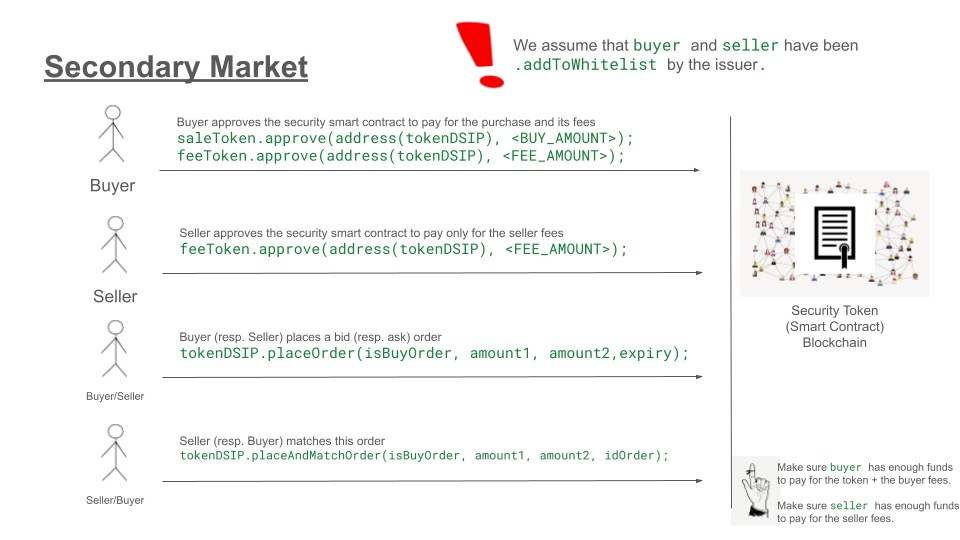

# Quickstart

This project uses Foundry, and is conveniently dockerized to be easily deployed.

In order to launch the environment go to the `docker` directory:

```
cd docker
```

There, just launch the `./launch` script, which essentially runs the official `ghcr.io/foundry-rs/foundry:latest` image and creates a container with a shared folder, so you can keep working on your local filesystem.

```
./launch
```

You should drop in a command line with everything configured. To compile the code just run:

```
forge compile
```

Same for tests (`forge test`).


# Digital Security Income Protocol

The Digital Security Income Protocol (DSIP) represents an advanced iteration of the Ethereum ERC-20 standard, incorporating augmented functionalities tailored for regulated digital asset trading. This smart contract has been developed in Solidity and targets all EVM-compatible blockchains, such as Ethereum and Polygon. The DSIP protocol introduces novel features, extending beyond the standard ERC-20 capabilities, to address specific requirements in digital securities management.

The DSIP token adheres to the IERC20 standard in order to ensure compatibility with common Ethereum wallets and infrastructure. However, it diverges from standard IERC20 behavior in its transfer mechanism. The necessity to incorporate fees and adhere to transfer lockout periods means that conventional token transfers, like those through Automated Market Makers (AMMs), are not feasible. This deviation from the standard transfer process is a critical design decision, shaped by the unique requirements of the DSIP token's economic model. Transfers are therefore carried out with the private function `._transferFromWithFee` , which receives an additional parameter `uint256 amountPaid`, in order to calculate the fee.

In order to trade tokens, the `OrderBook` (and its interface `IOrderBook`) have been developed. With its function `.placeOrder` users can publish their Buy/Sell orders, and with `.matchOrders` a matching engine (offchain) can match them. Finally, the `.placeAndMatchOrder` function allows a user to atomically send a new offer and match it with an existing one. It is important to note that transfers are executed *exclusively* through the placement and subsequent matching of limit orders in this on-chain OrderBook. This process starts with `placeOrder`, where a user specifies order details, ensuring that the user has sufficient balance or token allowance. Following this, `matchOrders` facilitates the trade between two orders by transferring the specified amounts of sale and security tokens between the parties.  


## Overview

| | |
|:-:|:-:|
|  |  |
|  |  |


## Quickstart

Below a heavily commented Foundry code snippet that illustrates how to instantiate a DSIP token:

```

contract DSIPSandbox {

	// Create some play addresses
    address investor1 = vm.addr(1);
    address investor2 = vm.addr(2);

	// Colisters are the entities among 
	// which the fees are split
    address colister1 = vm.addr(3);
    address colister2 = vm.addr(4);

	// Seller of the property
	// (not necessarily the issuer)
    address seller = vm.addr(5);

	// The account in charge of paying
	// dividends
    address dividendPayer = vm.addr(6);

	// Initial price (times 1e18)
    uint256 pricePrimaryMarket=1e18;

	// Fee in basis points (1/10000)
    uint16 fee=50;

    uint256 CAP = 100e21;


    MyToken tokenFee;
    MyToken tokenDividend;
    MyToken tokenPrimarySale;

    function setUp() public {

		// The identityManager is shared across
		// multiple tokens, so we define it
		// separatedly (and probably only once)

        identityManager = new IdentityManager(
                    address(this)
        );


		// Some play ERC20 tokens to pay fees,
		// dividens and initial sale. It can all
		// be the same (for example USDT/USDC/dai/etc)

        tokenFee = new MyToken("Fee Token", "FTK");
        tokenDividend = new MyToken("Divident Token", "DTK");
        tokenPrimarySale = new MyToken("Token Primary Sale", "USDT");

		// Here we initialize the DSIP token
		// The constructor is barebones (only
		// ERC20-related data and the owner. 

        tokenDSIP = new DSIP(
                "DSIP",
                "DSP",
                CAP,
                address(this)
        );


		// Here the actual initialization

        tokenDSIP.setIdentityManager(identityManager);
        tokenDSIP.setInitialSeller(seller);
        tokenDSIP.setDividendPayer(dividendPayer);
        tokenDSIP.setFeeToken(tokenFee);
        tokenDSIP.setSaleTokenPrimaryMarket(tokenPrimarySale);
        tokenDSIP.setPricePrimaryMarket(pricePrimaryMarket);
        tokenDSIP.setLockingTimeSeconds(0);
        tokenDSIP.setFeeStructure(fee, fee, fee, fee, 0);


		// We distribute some fee tokens to
		// allow transfers

        tokenFee.mint(investor1, 1e24);
        tokenFee.mint(investor2, 1e24);
        tokenFee.mint(seller, 1e24);


		// We mint some dividend tokens to
		// the dividendPayer account

        tokenDividend.mint(address(dividendPayer),1000e18);


		// Same with the token to pay for the
		// primary sale.

        tokenPrimarySale.mint(investor1, 1e6*1e18);
        tokenPrimarySale.mint(investor2, 1e6*1e18);
        tokenPrimarySale.mint(seller, 1e6*1e18);


		// vm.startPrank is a Foundry command
		// to allow us impersonate other accounts

        vm.startPrank(investor1);
		
		// We must approve the DSIP token
		// to charge fees
        tokenFee.approve(address(tokenDSIP), 1e24);

		// And to charge us the initial
		// price of the token
        tokenPrimarySale.approve(address(tokenDSIP), 1e6*1e18);
        vm.stopPrank();

		// Same with this other investor.
        vm.startPrank(investor2);
        tokenFee.approve(address(tokenDSIP), 1e24);
        tokenPrimarySale.approve(address(tokenDSIP), 1e6*1e18);
        vm.stopPrank();

		// And with the seller
        vm.startPrank(seller);
        tokenFee.approve(address(tokenDSIP), 100e22);
        tokenPrimarySale.approve(address(tokenDSIP), 1e6*1e18);
        vm.stopPrank();


		// We add the investor1 to the whitelist
		// otherwise they would not be able to
		// hold the token
        identityManager.addToWhitelist(investor1);


		// Finally we can send tokens to investor1
		// Note that both investor1 and seller paid
		// fees (the "approve" above).
        tokenDSIP.mint(investor1, 10*1e21);


		// Now, as the dividentPayer, you can set next payments
		// with tokenDSIP.setNextPayment...
		// See the test suite for more details

}
```


## Features

### Token Cap and ERC20Capped
The total supply of DSIP tokens is capped at 100,000, as enforced by the `ERC20Capped` extension.

### Fee Mechanism

Transactions can require a fee in a different token (usually a stablecoin). These fees are distributed in predetermined ratios, as required when co-listing on third-party platforms.
In order to save gas in particular scenarios (such as when there are no fees or no locking period), basic checks are carried out to skip blocks of functionality.

### Dividend Distribution

The DSIP incorporates a mechanism for dividend distribution in ERC20 tokens (usually stablecoins). This distribution is based both on number of tokens help and their duration, such that both current and past holders are compensated proportionally. In order to do that we keep track of the balance of users after each `transfer` or `mint`, not much different than what the `ERC20Votes` contract does for DAO tokens. This calculation is performed in the internal function `_getTokensTime`, defined in the `DividendManager`. The funds for paying the dividends are taken from `dividentPayer` when setting `.nextPayment` (with `.transferFrom`). If the call suceeds, it is guaranteed that the contract will always be funded enough to distribute the owed dividends.

### Lock Manager

The LockManager controls the locking time that a token must be held after receiving it. This is required in certain scenarios where some offchain documentation must be updated (e.g. the cap table).
Similar the FeeManagemenr, the LockManager performs checks to see if lock periods are defined, skipping calculations and thus saving gas when no locking period is required.


### ReentrancyGuard and Pausable

The inclusion of `ReentrancyGuard` prevents attacks that exploit recursive calls, while `Pausable` allows the contract to be paused, providing an emergency brake to stop operations in case of a detected vulnerability or other critical issues.

### Whitelisting and Compliance

The identity manager contract (`IIdentityManager`) manages the whitelist and define the modifier `onlyWhitelisted` to ensure that only approved addresses can interact with certain functions.

### Clawback and Freezing Accounts

The DSIP includes the `forceTranfer` function, to forcefully execute transactions in emergency situations. It bypasses fees and additional checks, and can only be called by the `owner`. This is essential for legal compliance and responding to fraudulent activities or lose of keys (in the case of self-custody). The execution of this function emits the `ForceTransfer` event.


## Additional considerations

The `_redeemDividends` in the `DividendManager` function uses the `_lastIndex` parameter to mitigate potential out-of-gas errors. It allows users to specify a maximum index in a `for` loop, so we can ensure that in niche cases there contract never stays locked due to gas exhaustion. In normal operation this `_lastIndex` variable should be set to `type(uint216).max`.


More generally, some operations might overflow in very niche cases. For example, `totalFunds * totalShares / 1e18` (assuming all variables `uint256`) will overflow when `totalFunds * totalShares > type(uint256).max`. There are two solutions here, none of which is perfect:

1. We can define `totalFunds` and `totalShares` as `uint128`, so that even in the worst case we don't overflow a `uint256`. In this case we'd be severely limiting the amount of funds and shares we can store in the variables.

2. We can check if `totalFunds/type(uint256).max < totalFunds` and if not, switch the order of operations, such that `totalFunds / 1e18 * totalShares`, therefore losing precision.

I suspect the best option is carefully use `require` in the user-controlled functions that increase the variables `totalFunds` and `totalShares`, and don't let the user increase them.
